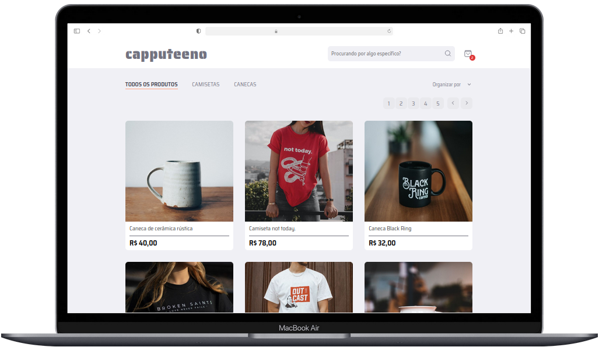

 
# E-commerce-capputeeno

##  👉 description
This is a fictional e-commerce platform where users can buy products.  
**Live demo:** <a href="https://e-commerce-capputeeno-p.web.app/">here</a> 👈

## 🛠️ technology used
html  
css  
React  
Typescript  

## 👀 pre-requirement
vite 5.2.0  
node v21.1.0  

## instalation
    git clone https://github.com/W4llyson2036/e-commerce-capputeeno.git
<!---->
    npm install
